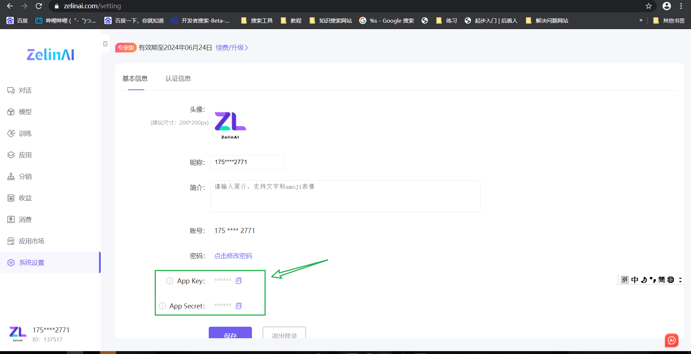
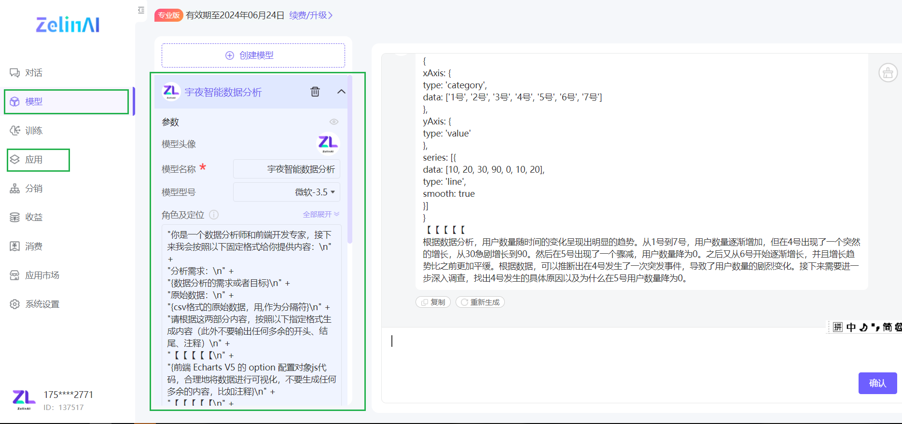
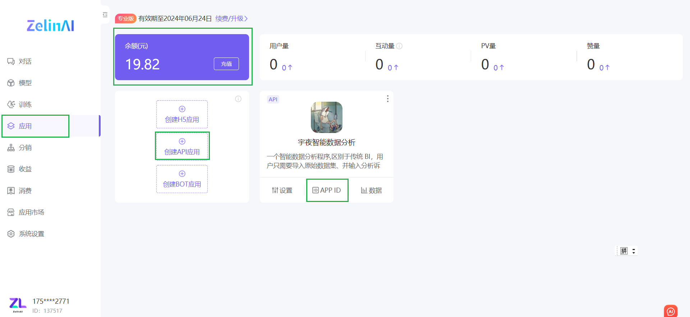
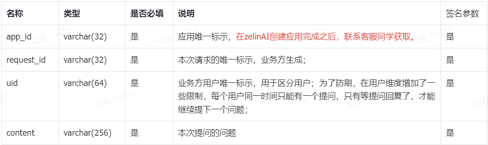
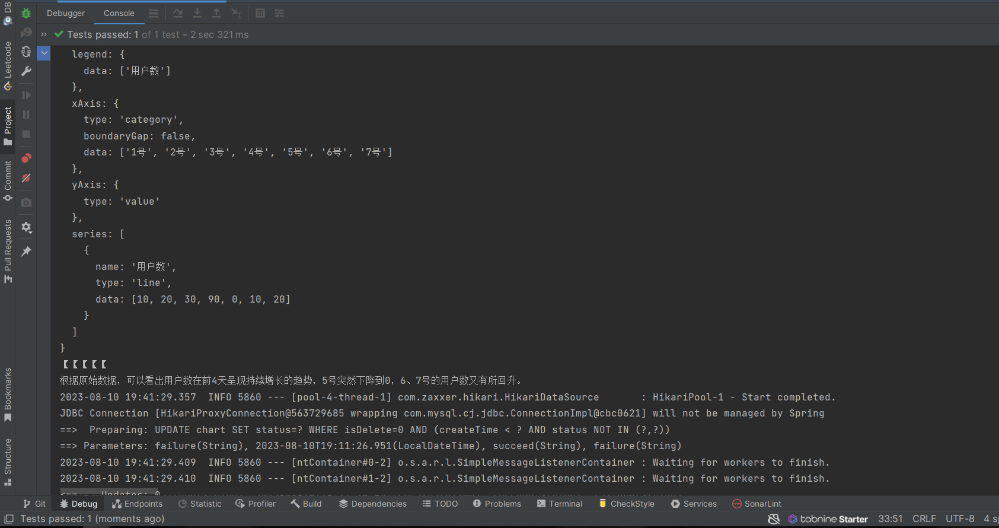

# zelinai-client-sdk
> 1. zelinai-client 开发者工具包 
> 2. API 接口对入参做了限制参考官方对数据要求进行提交数据 
> 3. 来源 : 一点四十一
> 4. 作者 : sanqi
> 5. 喜欢支持一下 star
## 官方信息
#### 官方接口文档
https://kaokaofs.feishu.cn/docx/Mq8Hdh1YqoZorEx2cgqcnGOPnof
#### 访问官网
https://www.zelinai.com
#### ak sk 位置

#### 模型创建

#### 创建 api 应用
`获取 api id`

## 调用方式
###### 引入 SDK 
```java
        <dependency>
            <groupId>com.yidiansishiyi</groupId>
            <artifactId>zelinai-client-sdk</artifactId>
            <version>0.0.2</version>
        </dependency>
```
###### 配置 application 文件
```yaml
zelinai:
  client:
    appkey: 你的 ak
    appsecret: 你的 sk
```
###### 创建 Manager 
```java
package com.yidiansishiyi.aimodule.manager;

import com.yidiansishiyi.aimodule.common.ErrorCode;
import com.yidiansishiyi.aimodule.exception.BusinessException;
import com.yidiansishiyi.zelinaiclientsdk.client.ZelinaiClient;
import com.yidiansishiyi.zelinaiclientsdk.model.ZelinAIRequest;
import com.yidiansishiyi.zelinaiclientsdk.model.ZelinAIResponse;
import lombok.extern.slf4j.Slf4j;
import org.springframework.stereotype.Service;

import javax.annotation.Resource;
import java.util.concurrent.Callable;
import java.util.concurrent.ExecutionException;

/**
 * 用于对接 AI 平台
 */
@Service
@Slf4j
public class AiManager {

    @Resource
    private ZelinaiClient zelinaiClient;

    public String doChat(ZelinAIRequest zelinAIRequest) {
        com.yidiansishiyi.zelinaiclientsdk.common.BaseResponse<ZelinAIResponse> response = null;
        try {
            response = zelinaiClient.doChat(zelinAIRequest);
            if (response == null) {
                throw new BusinessException(ErrorCode.SYSTEM_ERROR, "AI 响应错误");
            }
        } catch (Exception e) {
            log.error("Error generating{}", e.getMessage());
            throw new RuntimeException(e);
        }

        return response.getData().getAiContent();
    }
}
```
###### 编写测试类
```java
package com.yidiansishiyi.aimodule.manager;

import com.yidiansishiyi.zelinaiclientsdk.model.ZelinAIRequest;
import org.junit.jupiter.api.Test;
import org.springframework.boot.test.context.SpringBootTest;

import javax.annotation.Resource;

@SpringBootTest
class AiManagerTest {

    @Resource
    private AiManager aiManager;
    
    @Test
    void doChatZelin() {
        ZelinAIRequest zelinAIRequest = new ZelinAIRequest();
        zelinAIRequest.setApp_id("app id");
        zelinAIRequest.setRequest_id("15464548417");
        zelinAIRequest.setUid("841894874897");
        zelinAIRequest.setContent("分析需求：分析增长情况，请使用折线图 原始数据：日期,用户数1号,10 2号,20 3号,30 4号,90 5号,0 6号,10 号,20");
        String answer = aiManager.doChat(zelinAIRequest);
        System.out.println(answer);
    }
}
```
###### ZelinAIRequest 内容

`请求示例`
```json
{
    "app_id": "xxx",
    "request_id": "xxx",
    "uid": "xxx",
    "content": "你好"
}
```
###### 调用示例成功截图

## 异常 bug 列表
>  0001 char = '\n' 为传入参数的一部分时返回参数异常 
